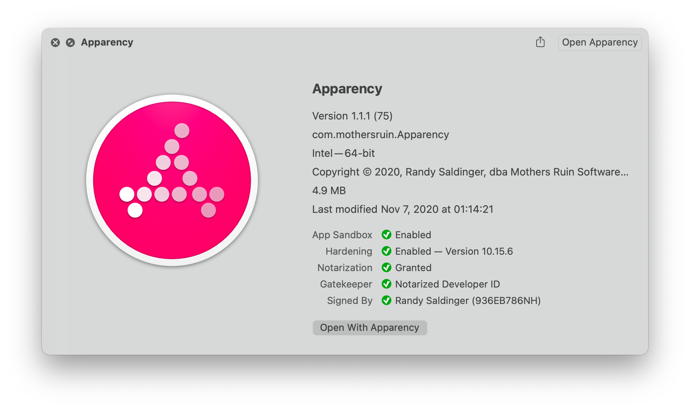
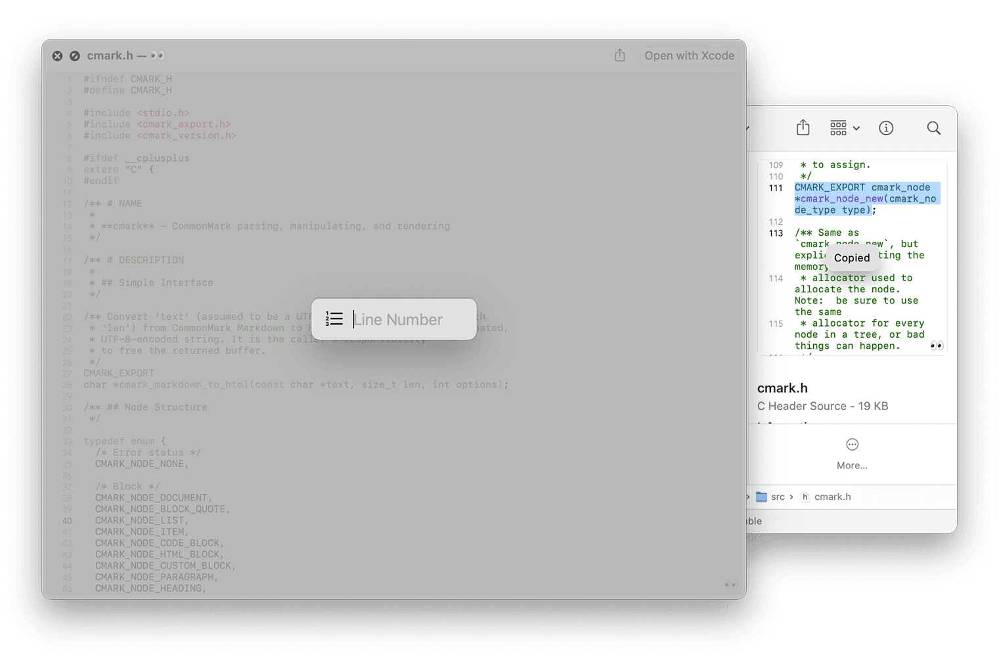

# Quick Look plugins [](https://awesome.re)

> List of useful 🌎 [Quick Look](en.wikipedia.org/wiki/Quick_Look) plugins for developers

## Install

### Using 🌎 [Homebrew](brew.sh)

- Run `brew install <package>`

#### Install all

```
brew install qlcolorcode qlstephen qlmarkdown quicklook-json qlimagesize suspicious-package apparency quicklookase qlvideo
```

##### Catalina notes

To get plugins working in Catalina, you will need to remove the quarantine attribute.

Run this to see the attributes:

```
xattr -r ~/Library/QuickLook
```

And run this to remove the attributes:

```
xattr -d -r com.apple.quarantine ~/Library/QuickLook
```

### Manually

- Click "download manually"
- Move the downloaded .qlgenerator file to `~/Library/QuickLook`
- Run `qlmanage -r`

## Plugins

### <b><code>&nbsp;&nbsp;&nbsp;682⭐</code></b> <b><code>&nbsp;&nbsp;&nbsp;&nbsp;48🍴</code></b> [QLColorCode](https://github.com/anthonygelibert/QLColorCode))

> Preview source code files with syntax highlighting

Run `brew install qlcolorcode` or <b><code>&nbsp;&nbsp;&nbsp;&nbsp;&nbsp;?⭐</code></b> <b><code>&nbsp;&nbsp;&nbsp;&nbsp;&nbsp;?🍴</code></b> [download manually](https://github.com/anthonygelibert/QLColorCode/releases/latest))

[](https://github.com/anthonygelibert/QLColorCode)

### <b><code>&nbsp;&nbsp;2777⭐</code></b> <b><code>&nbsp;&nbsp;&nbsp;165🍴</code></b> [QLStephen](https://github.com/whomwah/qlstephen))

> Preview plain text files without or with unknown file extension. Example: README, CHANGELOG, index.styl, etc.

Run `brew install qlstephen` or <b><code>&nbsp;&nbsp;&nbsp;&nbsp;&nbsp;?⭐</code></b> <b><code>&nbsp;&nbsp;&nbsp;&nbsp;&nbsp;?🍴</code></b> [download manually](https://github.com/whomwah/qlstephen/releases/latest))

[](https://github.com/whomwah/qlstephen)

### <b><code>&nbsp;&nbsp;3265⭐</code></b> <b><code>&nbsp;&nbsp;&nbsp;142🍴</code></b> [QLMarkdown](https://github.com/toland/qlmarkdown))

> Preview Markdown files

Run `brew install qlmarkdown` or <b><code>&nbsp;&nbsp;&nbsp;&nbsp;&nbsp;?⭐</code></b> <b><code>&nbsp;&nbsp;&nbsp;&nbsp;&nbsp;?🍴</code></b> [download manually](https://github.com/downloads/toland/qlmarkdown/QLMarkdown-1.3.zip))

[](https://github.com/toland/qlmarkdown)

### [QuickLookJSON](http://www.sagtau.com/quicklookjson.html)

> Preview JSON files

Run `brew install quicklook-json` or [download manually](http://www.sagtau.com/media/QuickLookJSON.qlgenerator.zip)

[](http://www.sagtau.com/quicklookjson.html)

### 🌎 [BetterZipQL](macitbetter.com/downloads/)

> Preview archives

> Note: The BetterZipQL plugin was integrated with the BetterZip app.

Run `brew install betterzip` to install the BetterZip app and its Quick Look plugin or 🌎 [download manually](macitbetter.com/BetterZip.zip)

The legacy BetterZipQL plugin can be 🌎 [downloaded here](macitbetter.com/dl/BetterZipQL-1.5.zip).

[](https://macitbetter.com/BetterZip-Quick-Look-Generator/)

### <b><code>&nbsp;&nbsp;1203⭐</code></b> <b><code>&nbsp;&nbsp;&nbsp;&nbsp;67🍴</code></b> [qlImageSize](https://github.com/Nyx0uf/qlImageSize))

> Display image size and resolution

Run `brew install qlimagesize` or <b><code>&nbsp;&nbsp;1203⭐</code></b> <b><code>&nbsp;&nbsp;&nbsp;&nbsp;67🍴</code></b> [download manually](https://github.com/Nyx0uf/qlImageSize#installation))

[](https://github.com/Nyx0uf/qlImageSize)

### 🌎 [Suspicious Package](www.mothersruin.com/software/SuspiciousPackage/)

> Preview the contents of a standard Apple installer package

Run `brew install suspicious-package` or 🌎 [download manually](www.mothersruin.com/software/downloads/SuspiciousPackage.xip)

[](https://www.mothersruin.com/software/SuspiciousPackage/)

### 🌎 [Apparency](www.mothersruin.com/software/Apparency/)

> Preview the contents of a macOS app

Run `brew install apparency` or 🌎 [download manually](mothersruin.com/software/downloads/Apparency.dmg)

[](https://mothersruin.com/software/Apparency/)

### <b><code>&nbsp;&nbsp;&nbsp;&nbsp;44⭐</code></b> <b><code>&nbsp;&nbsp;&nbsp;&nbsp;&nbsp;1🍴</code></b> [QuickLookASE](https://github.com/rsodre/QuickLookASE))

> Preview Adobe ASE Color Swatches generated with Adobe Photoshop, Adobe Illustrator, 🌎 [Adobe Color CC](color.adobe.com), [Spectrum](http://www.eigenlogik.com/spectrum/mac), 🌎 [COLOURlovers](www.colourlovers.com), [Prisma](http://www.codeadventure.com), among many others.

Run `brew install quicklookase` or <b><code>&nbsp;&nbsp;&nbsp;&nbsp;&nbsp;?⭐</code></b> <b><code>&nbsp;&nbsp;&nbsp;&nbsp;&nbsp;?🍴</code></b> [download manually](https://github.com/rsodre/QuickLookASE/releases/latest))

[](https://github.com/rsodre/QuickLookASE)

### <b><code>&nbsp;&nbsp;2676⭐</code></b> <b><code>&nbsp;&nbsp;&nbsp;&nbsp;95🍴</code></b> [QLVideo](https://github.com/Marginal/QLVideo))

> Preview most types of video files, as well as their thumbnails, cover art and metadata

Run `brew install qlvideo` or <b><code>&nbsp;&nbsp;&nbsp;&nbsp;&nbsp;?⭐</code></b> <b><code>&nbsp;&nbsp;&nbsp;&nbsp;&nbsp;?🍴</code></b> [download manually](https://github.com/Marginal/QLVideo/releases/latest))

[](https://github.com/Marginal/QLVideo)

## More

*These are not included in [Install all](#install-all).*

### 🌎 [Peek](bigzlabs.com/peek) 💰

> Peek allows you to copy and find text, jump to line numbers, render Github-flavored Markdown with a generated table of contents, restore scroll positions, highlight syntax, & more in the Quick Look previews of over 300 file extensions.

Purchase on the 🌎 [Mac App Store](apps.apple.com/app/peek-quick-look-extension/id1554235898)

[](https://bigzlabs.com/peek)

### <b><code>&nbsp;&nbsp;2376⭐</code></b> <b><code>&nbsp;&nbsp;&nbsp;155🍴</code></b> [ProvisionQL](https://github.com/ealeksandrov/ProvisionQL))

> Preview iOS / macOS app and provision information

Run `brew install provisionql` or <b><code>&nbsp;&nbsp;&nbsp;&nbsp;&nbsp;?⭐</code></b> <b><code>&nbsp;&nbsp;&nbsp;&nbsp;&nbsp;?🍴</code></b> [download manually](https://github.com/ealeksandrov/ProvisionQL/releases/latest))

[](https://github.com/ealeksandrov/ProvisionQL)

### <b><code>&nbsp;&nbsp;&nbsp;150⭐</code></b> <b><code>&nbsp;&nbsp;&nbsp;&nbsp;38🍴</code></b> [QuickLookAPK](https://github.com/hezi/QuickLookAPK))

> Preview Android APK files

Run `brew install quicklookapk` or <b><code>&nbsp;&nbsp;&nbsp;150⭐</code></b> <b><code>&nbsp;&nbsp;&nbsp;&nbsp;38🍴</code></b> [download manually](https://github.com/hezi/QuickLookAPK/blob/master/QuickLookAPK.qlgenerator.zip))

[](https://github.com/hezi/QuickLookAPK)

### <b><code>&nbsp;&nbsp;&nbsp;&nbsp;32⭐</code></b> <b><code>&nbsp;&nbsp;&nbsp;&nbsp;&nbsp;0🍴</code></b> [quicklook-pat](https://github.com/pixelrowdies/quicklook-pat))

> Preview Adobe Photoshop pattern files

Run `brew install quicklook-pat` or <b><code>&nbsp;&nbsp;&nbsp;&nbsp;&nbsp;?⭐</code></b> <b><code>&nbsp;&nbsp;&nbsp;&nbsp;&nbsp;?🍴</code></b> [download manually](https://github.com/pixelrowdies/quicklook-pat/releases))

[](https://github.com/pixelrowdies/quicklook-pat)

### <b><code>&nbsp;&nbsp;&nbsp;286⭐</code></b> <b><code>&nbsp;&nbsp;&nbsp;&nbsp;24🍴</code></b> [WebP](https://github.com/dchest/webp-quicklook))

> Preview WebP images

> NOTE: This is already covered by `qlImageSize`, so this plugin is listed here only in case you do not like `qlImageSize`.

Run `brew install webpquicklook` or <b><code>&nbsp;&nbsp;&nbsp;&nbsp;&nbsp;?⭐</code></b> <b><code>&nbsp;&nbsp;&nbsp;&nbsp;&nbsp;?🍴</code></b> [download manually](https://github.com/dchest/webp-quicklook/releases/latest))

[](https://github.com/dchest/webp-quicklook)

### <b><code>&nbsp;&nbsp;3170⭐</code></b> <b><code>&nbsp;&nbsp;&nbsp;&nbsp;76🍴</code></b> [SourceCodeSyntaxHighlight](https://github.com/sbarex/SourceCodeSyntaxHighlight))

> Preview many different source code files

Run `brew install --cask --no-quarantine syntax-highlight` or <b><code>&nbsp;&nbsp;&nbsp;&nbsp;&nbsp;?⭐</code></b> <b><code>&nbsp;&nbsp;&nbsp;&nbsp;&nbsp;?🍴</code></b> [download manually](https://github.com/sbarex/SourceCodeSyntaxHighlight/releases/latest))

[](https://github.com/sbarex/SourceCodeSyntaxHighlight)

**Note:** This might overwrite some other Quick Look plugins.

## License

[](https://creativecommons.org/publicdomain/zero/1.0/)

To the extent possible under law, 🌎 [Sindre Sorhus](sindresorhus.com) has waived all copyright and related or neighboring rights to this work.

## Source
<b><code>&nbsp;18190⭐</code></b> <b><code>&nbsp;&nbsp;&nbsp;537🍴</code></b> [sindresorhus/quick-look-plugins](https://github.com/sindresorhus/quick-look-plugins))